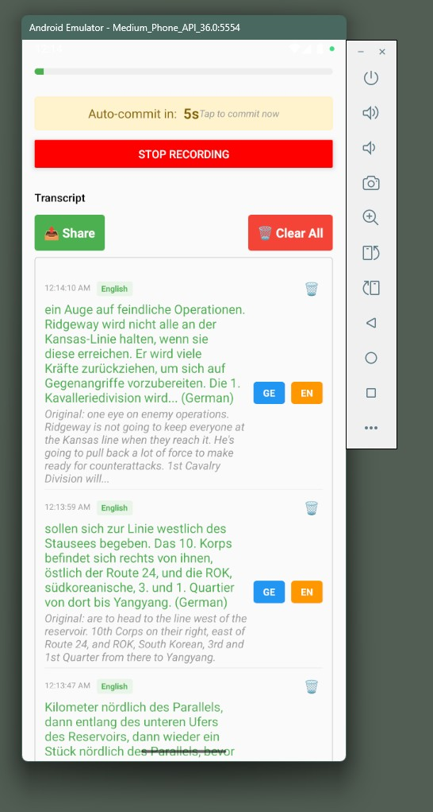

# BabelScribe

A real-time speech transcription and translation app for Android built with React Native and OpenAI's Realtime API.

## Overview

BabelScribe is a powerful mobile application that provides real-time speech-to-text transcription with automatic language detection and translation capabilities. It leverages OpenAI's Realtime API to deliver accurate transcriptions and seamless translations between multiple languages.



## Key Features

### 🎙️ Real-Time Transcription
- Live speech-to-text conversion using OpenAI's Realtime API
- Support for multiple transcription models:
  - GPT-4o Mini Transcribe
  - GPT-4o Transcribe
  - Whisper-1
- Visual audio level meter showing real-time volume
- Automatic language detection for each transcript

### 🌍 Automatic Translation
- **Smart Auto-Translation**: When you speak in one of your configured target languages, it automatically translates to the other
- **Dual Language Support**: Configure Language A and Language B for bidirectional translation
- **55+ Supported Languages**: Including English, German, Spanish, French, Italian, Portuguese, Russian, Japanese, Korean, Chinese, and many more
- **Manual Translation Options**: Blue and orange buttons for on-demand translation to either target language

### ⏱️ Smart Recording Management
- **Auto-Commit Timer**: 10-second countdown with visual display
- **Manual Commit**: Tap the countdown display to commit immediately
- **Intelligent Buffer Management**: Only commits when at least 100ms of audio is available
- **Continuous Recording**: Automatically cycles after commits during active recording

### 📝 Transcript Management
- **Individual Deletion**: Remove specific transcripts with confirmation
- **Bulk Clear**: Clear all transcripts at once
- **Share Functionality**: Export and share your transcripts
- **Persistent Storage**: API key, model selection, and language preferences are saved
- **Visual Language Badges**: See the detected language for each transcript

## Technical Details

### Built With
- **React Native**: Cross-platform mobile development
- **TypeScript**: Type-safe code
- **OpenAI Realtime API**: WebSocket-based real-time transcription
- **react-native-audio-record**: Audio recording capabilities
- **AsyncStorage**: Persistent data storage
- **franc**: Language detection

### Audio Processing
- **Sample Rate**: 16kHz mono
- **Encoding**: 16-bit PCM, Base64
- **Chunk Size**: 100ms audio chunks
- **Real-time Volume Calculation**: RMS-based audio level visualization

## Installation

### Prerequisites
- Node.js (v14 or higher)
- React Native development environment set up
- Android Studio (for Android development)
- OpenAI API key

### Setup Steps

1. Clone the repository:
```bash
git clone <repository-url>
cd BabelApp
```

2. Install dependencies:
```bash
npm install
```

3. Install iOS pods (if building for iOS):
```bash
cd ios && pod install && cd ..
```

4. Run the app:
```bash
# For Android
npx react-native run-android

# For iOS
npx react-native run-ios
```

## Usage

1. **Configure API Key**: Enter your OpenAI API key in the app settings
2. **Select Model**: Choose your preferred transcription model
3. **Set Target Languages**: 
   - Language A (Blue Button): Your primary language
   - Language B (Orange Button): Your secondary language
4. **Start Recording**: Press the "Start Recording" button
5. **Speak**: The app will transcribe your speech in real-time
6. **Auto-Translation**: If you speak in Language A, it auto-translates to Language B and vice versa
7. **Manual Translation**: Use the blue/orange buttons for additional translations
8. **Share Results**: Use the share button to export your transcripts

## Configuration

### Language Settings
- **Language A**: Primary target language (default: German)
- **Language B**: Secondary target language (default: English)
- Auto-translation occurs when the detected language matches either target language

### Model Selection
- **GPT-4o Mini Transcribe**: Fast and efficient
- **GPT-4o Transcribe**: Higher accuracy
- **Whisper-1**: OpenAI's dedicated speech recognition model

## Permissions

The app requires the following permissions:
- **Microphone**: For audio recording
- **Storage**: For saving preferences (API key, language settings)

## Building for Release

### Android APK
```bash
cd android
./gradlew assembleRelease
```

The signed APK will be available at:
`android/app/build/outputs/apk/release/app-release.apk`

## License

This project is licensed under the MIT License - see the LICENSE file for details.